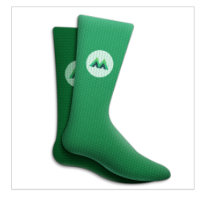
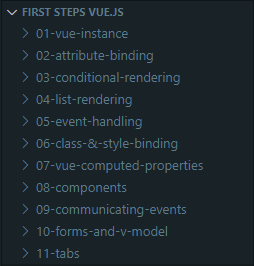
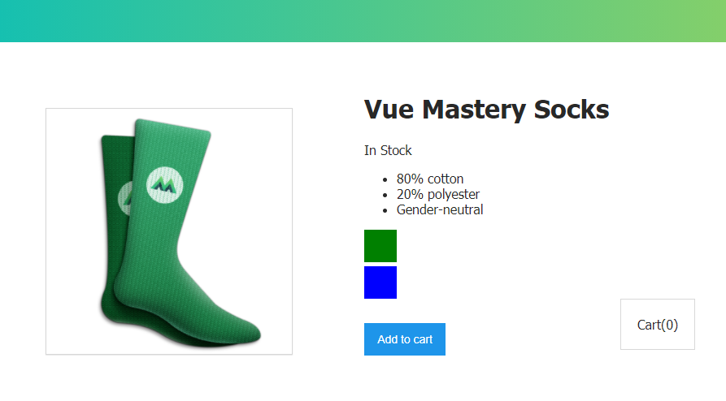
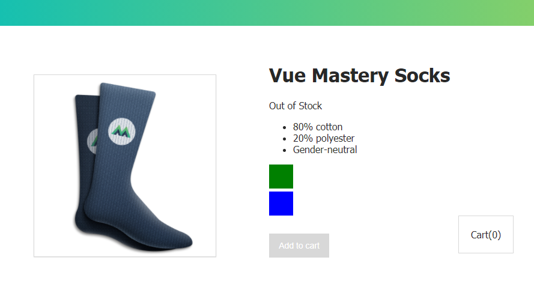
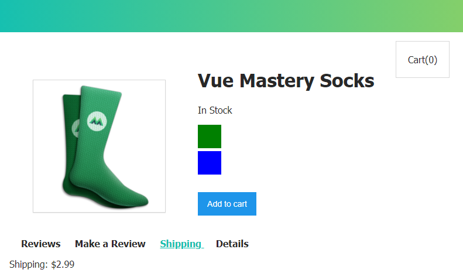

# First Steps learning Vue.js

---

## Description

Learning [course](https://www.vuemastery.com/courses/intro-to-vue-js/) about the basics of [Vue.js](https://vuejs.org/).

---

## More screenshots

**First steps**

**Hey Adam, we are running out of stock!**

**Finally, everything is okay and the last challenge was completed!**

## Credit

[Vue.js](https://vuejs.org/) & [Vue Mastery](https://www.vuemastery.com/courses/intro-to-vue-js/).